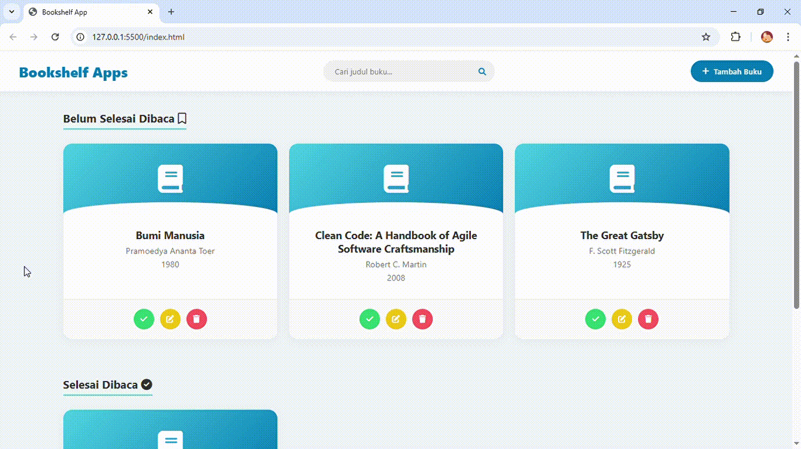
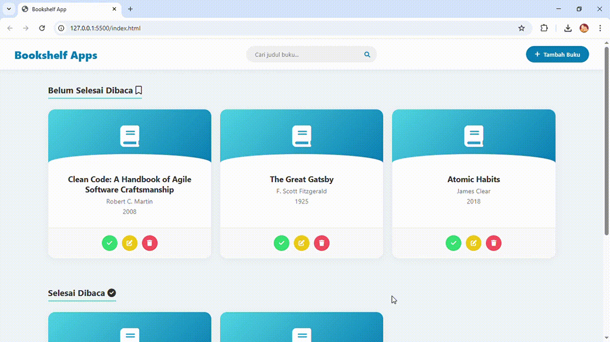
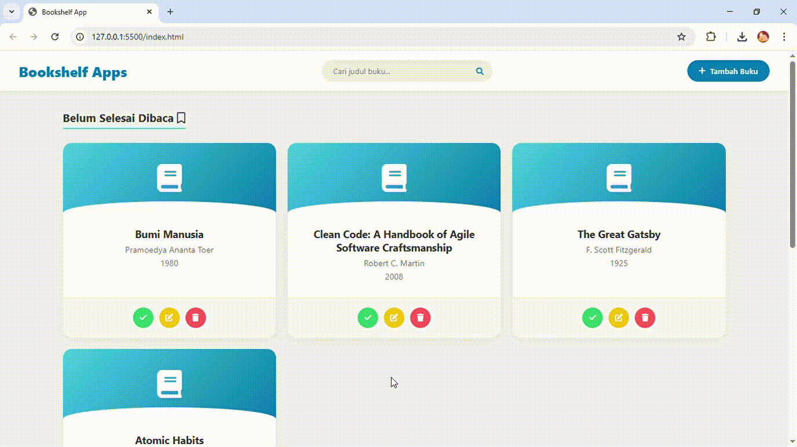

# Submission: Belajar Membuat Front-End Web untuk Pemula (IDCamp 2025)

Selamat datang di repository proyek submission saya untuk kelas **"Belajar Membuat Front-End Web untuk Pemula"** dari Dicoding. Proyek ini adalah sebuah aplikasi web berbasis **DOM Manipulation** dan **Web Storage** yang berfungsi untuk mengelola daftar buku bacaan, memisahkan buku yang sudah selesai dibaca dan yang belum.

---

---

## Fitur & Demo Aplikasi

Berikut adalah fitur-fitur utama yang tersedia dalam aplikasi ini:

| Fitur | Deskripsi & Demo |
| :--- | :--- |
| **1. Menambahkan Buku** | Pengguna dapat memasukkan judul, penulis, dan tahun terbit buku ke dalam rak "Belum Selesai Dibaca" atau "Selesai Dibaca".   |
| **2. Pencarian Buku** | Fitur pencarian *real-time* untuk memfilter buku berdasarkan judul, memudahkan pengguna menemukan buku dalam daftar.   |
| **3. Memindahkan Rak** | Memindahkan buku antar rak dengan mudah (dari *Belum Selesai* ke *Selesai*, dan sebaliknya).   |
| **4. Mengedit Buku** | **(Fitur Tambahan)** Memperbarui detail buku (Judul, Penulis, Tahun) jika terjadi kesalahan input, tanpa perlu menghapus buku.   |
| **5. Menghapus Buku** | Menghapus buku dari daftar sepenuhnya dengan konfirmasi dialog untuk mencegah penghapusan yang tidak disengaja.   |

---

## Teknologi yang Digunakan
* **HTML5:** Membangun struktur semantik halaman web.
* **CSS3:** Styling antarmuka agar rapi dan responsif.
* **JavaScript (ES6):**
    * **DOM Manipulation:** Membuat, mengubah, dan menghapus elemen HTML secara dinamis.
    * **Event Handling:** Menangani interaksi user (klik, submit form, load).
    * **Web Storage (LocalStorage):** Menyimpan data objek buku (JSON) di sisi klien.

---

## Materi yang Dipelajari & Diterapkan

Aplikasi ini merupakan implementasi dari materi-materi yang telah saya pelajari selama mengikuti kelas "Belajar Membuat Front-End Web untuk Pemula" di Dicoding. Berikut adalah rangkuman materi tersebut:

* **Browser Object Model (BOM) & Document Object Model (DOM)**
    Mempelajari penerapan BOM dan DOM pada halaman website. Selain itu, modul ini mengajarkan teknik pemanipulasian DOM menggunakan JavaScript.

* **Interaktif dengan Event**
   Mempelajari penerapan event dalam menciptakan interaktifitas pada HTML element.
  
* **Penyimpanan Data dengan Web Storage**
    Mempelajari API browser yang berguna untuk penyimpanan data melalui Web Storage. Dalam modul ini mengajarkan mengenai tipe-tipe storage beserta penerapannya.
  
* **Evaluasi Pembelajaran (Submission)**
    Submission (proyek akhir) membuat sebuah website yang menerapkan teknik manipulasi DOM dan web storage.
  
---

## Penulis

* **Nama:** Muhamad Afriza
* **GitHub:** [@Frizhub01](https://github.com/Frizhub01)
* **Instagram:** [@frz_326](https://www.instagram.com/frz_326/)
* **Kredensial:** [Sertifikat Kelulusan Kelas Front-End](https://www.dicoding.com/certificates/0LZ050QD3X65)

Dibuat dengan semangat belajar sebagai bagian dari perjalanan menjadi Front-End Web Developer di IDCamp.
